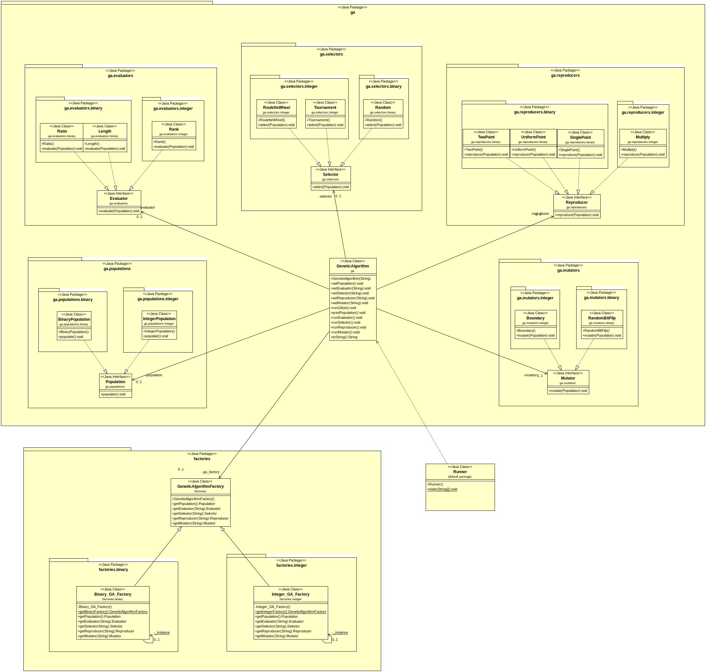

# CS613 - Genetic Algorithm Prototype #
*Kevin Corcoran - 14301776*

## Run ##

1. Navigate to the `src` folder. 
2. Run the following command in Terminal (linux).
```bash
javac -d ./../bin *.java ; java -cp ./../bin Runner 
```
Note: The `;` in the above command may need to be exchanged for an `&` depending on your OS.


## Information ##

### Generic Genetic Algorithm [CS404 Diarmuid O'Donoghue] ###
Step 1. Create an inital population.  
Step 2. Evaluate the fitness of each individual of the population.  
Step 3. Select particular individuals for reproduction (crossover) with the primary aim of promoting the fittest individuals.  
Step 4. Reproduce with the selected individuals from the population in order to produce a new population.  
Step 5. Mutate a small percentage of the population in order to maintain diversity.  
Step 6. Repeat steps 2 - 5 for several iterations until a particular convergence is met or number of iterations.

## Patterns ##

Given the above algorithm the following patterns were implemented. The following image is a class diagram of the final structure (doc/classdiagram.png).



### Strategy Pattern ###
My implentation of this pattern aimed to give the client the ability to create a 'genetic algoritm' object and configure its Population, Evaluator, ...etc (ie. its behaviours). These behaviours can then be interchanged at runtime allowing the client to run `X` number of algorithm iterations, change to a different Evaluator, Selector, ...etc. and then continue running the algorithm.

#### Decisions ####
* __printPopulation(), runEvaluator(), runSelector(), runReproducer(), runMutator():__   
  I decided to leave these functions public to give clients the ability to have more flexitbilty over the flow of control of their algorithm should they require it. This is demonstrated in the second genetic algoritm object `gaB_2`.


### Abstract Factory Pattern ###
Since the populations in genetic algorithms can be represented as Binary, float or Integer the implementation of this pattern aimed to provided an interface for producing Binary or Integer Populations, Evaluators, ...etc. For this project, just the Binary and Integer factories will be designed. Thanks to the implemented package structure each factory can import only the correct classes thus ensuring the factory can only produce the appropriate classes.

#### Decisions ####
It was initially the intention to use `enum`s and `generics` in order to provide a type safe design. However, despite near completion the implemention was not completed and the design reverted to using `String`s. This was done since the enum and generic implementation resulted in a cumbersome design with typesafe warning. This may of been due to a novice understanding of generics. To compensate for the lack of enums the factories print a message to notify the client of their error.

### Singleton Pattern (Thread Safe) ###
The implementation of this pattern aimed to prevent the creation of multiple Factory objects.  
    
For example,   
upon the creation of multiple 'genetic algorithm' objects comes the creation of an 'Integer' or 'Binary' factory for each genetic algorithm object. Thus, there may be many Binary(or Integer) factory objects which are performing the same functionality.

## Packages ##
The package structure was choosen to improve readability for further developers and means only the necessary classes need be imported for the appropriate factory.


## Output ##

#### Basic Output ####
The given Java code runs in a Single Threaded Environment. This is done to improve the readability of the output on intial execution.

#### Multithreading: #### 

To activate a second thread, change the `boolean` variable `MultiThreadedEnvironment` (line 10) to `true`.

Its worth noting that this will reduce the readablity of the output since both threads will be printing over each other. 

Once the multithreaded environment is activated it will help show the singleton pattern implementation in action.